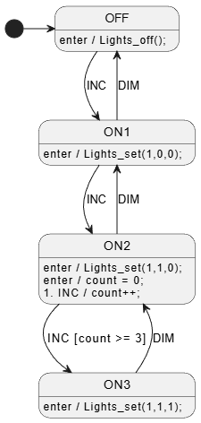

Typical C state machine implementation.

Pros/Cons:
- ✅ state variables are private (file static) in .c
    - 👎harder to access for testing
- variables are initialized at file scope
    - 👎harder to reset for testing
- state enumeration private in .c file
    - can sometimes be a bit helpful, but I wouldn't say required
- ❌C++ test code includes .c file to access private vars and definitions.
    - 👎I'm really not a fan of including source files into test files.
    - 👎`C` code compiled as `C++`.
    - more info in presentation.

