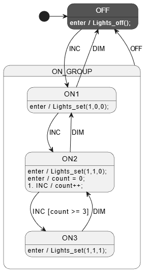

This FSM builds on V1 design and adds a nested parent state and `OFF` event.

Pros/Cons:
- ✅state variables are private (file static) in .c
- ✅`.c` file is NOT included into `.cpp` file for unit testing.
- ✅`.c` file is compiled as `C` (not `C++`) for unit testing.
- ✅No special `UNIT_TESTING` accessors.
    - This is more about how it is unit tested than how the .c file is written.
- public setup method.
    - should only be called once at startup in production code
    - 👍easy to reset state for unit testing
- public `get_state()` function.
    - 👍useful for testing
    - available to production code as well because it is often useful for display/logging



It uses [StateSmith](https://github.com/StateSmith/StateSmith) and [.inc files](https://github.com/StateSmith/StateSmith-examples/blob/main/c-include-sm-basic-2-plantuml-tutorial).

Generate code from PlantUML diagram with StateSmith CLI:
```bash
common/V2$ ss.cli run --here
```
Open `.sim.html` file in a web browser to interact with the state machine design.
